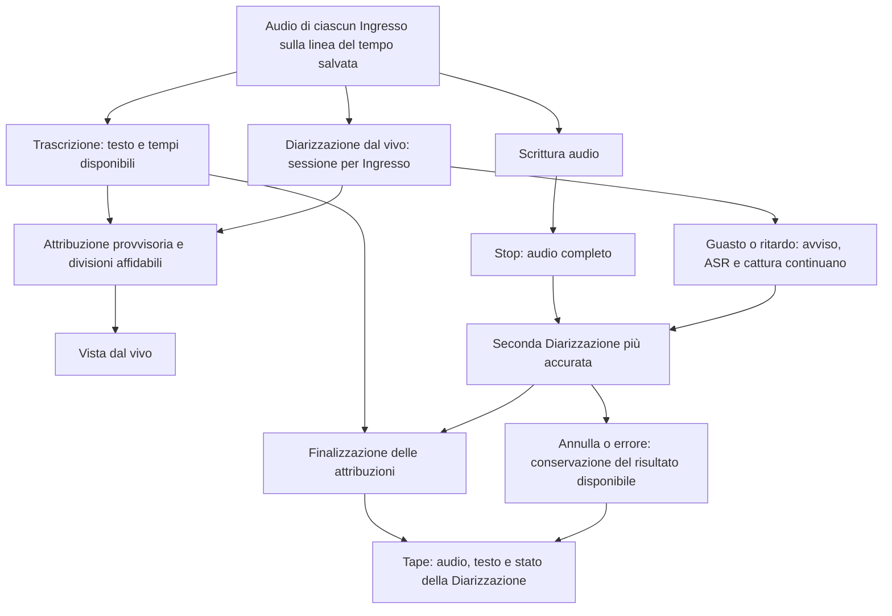

# Nemotron 3 Diarization, anche durante la Registrazione

Stato: progettazione approvata con `grill-with-docs`. Data: 2026-10-05.
Questa spec descrive la prova concordata, non funzionalità già implementate. L'approvazione delle scelte non avvia il codice: la skill richiede un via libera successivo per l'implementazione.

## Decisioni confermate

- Migliorare l'attribuzione delle Frasi rispetto a Sortformer 4spk v2.1 e distinguere fino a 8 Parlanti con Nemotron 3 Diarization.
- Riconoscere i Parlanti anche durante la Registrazione, insieme alla Trascrizione dal vivo; il solo riconoscimento dopo Stop non soddisfa l'obiettivo.
- La Diarizzazione continua a essere locale, su Windows x64.
- Per la prova si usa la PR upstream #175 fissata a un commit preciso, anche se non ancora rilasciata. Runtime, binding e modello devono essere compatibili fra loro; il supporto su Windows/Vulkan è da convalidare.
- Il ritardo desiderato per vedere il Parlante è circa 1–2 secondi. È un obiettivo osservabile dell'app, non una promessa dedotta dalla sola latenza di buffer del modello.
- Dal vivo si mostra l'attribuzione provvisoria e si consentono correzioni automatiche successive; la sua natura provvisoria deve essere riconoscibile.
- Quando due persone si alternano all'interno di una Frase, il testo si divide al cambio di Parlante se i tempi disponibili lo permettono. Con Nemotron e Parakeet si usano i tempi dei token/parole quando affidabili; con Whisper si conservano i segmenti, mostrando "Parlante non determinato" nei tratti con più voci non separabili. Parakeet e Whisper continuano a mostrare il testo alla chiusura della Frase.
- Dopo Stop si completa lo stream e si esegue una seconda Diarizzazione più accurata sull'audio salvato, senza ritrascrivere il testo. Le attribuzioni provvisorie possono cambiare.
- Se la Diarizzazione dal vivo si guasta o non tiene il passo, Registrazione e Trascrizione continuano. Un avviso esplicito segnala l'interruzione dei Parlanti dal vivo; si riprova a posteriori, se possibile. Audio e testo non devono andare persi per un guasto della Diarizzazione.
- Nemotron resta un'alternativa sperimentale selezionabile nelle Impostazioni; Sortformer resta disponibile per il confronto, senza promozione automatica a predefinito né eliminazione automatica dei suoi file.
- Quando le parole di voci sovrapposte non sono attribuibili in modo affidabile, si conserva il testo e si mostra "Parlante non determinato". La trascrizione separata delle voci simultanee è fuori dalla prima prova.
- Pausa/Riprendi conserva la sessione e le identità dei Parlanti; i tempi restano quelli dell'audio salvato, pause escluse. I nomi si possono cambiare solo quando l'analisi finale è terminata. Ogni nuova Registrazione apre una nuova sessione: i numeri non identificano una persona fra Tape diversi.
- La Continuazione, progettata negli ADR ma non ancora implementata, è fuori dalla prima prova. Non si aggiunge riconoscimento di identità fra sessioni o Ingressi.
- Annulla durante la seconda Diarizzazione conserva il Tape con audio, testo e attribuzioni disponibili, e lo indica come "Diarizzazione non completata". Le attribuzioni non consolidate restano provvisorie; quelle ambigue non diventano definitive. La stessa conservazione vale per un errore della seconda analisi.
- Il modello della prova si prepara localmente con origine, converter, dimensione e SHA-256 riproducibili. La distribuzione pubblica/download da Impostazioni non fa parte della prima prova.

Il secondo punto riapre ADR-0006, che prevede la Diarizzazione solo a posteriori. Il perimetro degli Ingressi resta quello di ADR-0015: Microfono e Audio di sistema separati, con il riconoscimento di più Parlanti al Microfono solo quando richiesto dall'utente. Il limite di 8 riguarda ciascuna sessione del modello e non implica identità condivise tra Ingressi.

## Fatti verificati

- Memotape usa `transcribe-cpp` 0.2.4. Nemotron 3 Diarization non è supportato neppure da transcribe.cpp v0.3.1, pubblicata il 2026-10-04.
- Il port upstream, con API Rust offline e streaming, è nella PR #175 ancora aperta. Il solo cambio del file del modello non basta.
- Il commit della PR verificato è `e6672a8672913b47f1571c66c54bee789d028416`. Il crate del branch dichiara versione 0.2.3: non si deve dedurre la compatibilità dalla versione del pacchetto, e va verificata la regressione rispetto all'attuale 0.2.4.
- L'artefatto candidato è il BF16 prodotto dal converter dello stesso commit, dal checkpoint NVIDIA alla revisione `f667ed73aee57d40cc39428eb768b4fd87a0a29e`. Non è ancora stato convertito né provato; dimensione e SHA-256 del GGUF risultante si potranno fissare solo dopo la produzione dell'artefatto. Python/NeMo servono alla preparazione, non all'utente dell'app.
- NVIDIA NeMo-Speech.cpp offre un runtime nativo alternativo, con GGUF e API C per lo streaming. Introdurlo richiede verificare binding, packaging e convivenza dei runtime.
- Il GGUF di Glimpse è destinato al suo fork; non si presume compatibile con il port upstream.
- La latenza di buffer pubblicata dal modello esclude il tempo di calcolo e il ritardo dell'ASR. Le prestazioni su Windows con ASR e Diarizzazione insieme restano da misurare.
- Il contratto ASR attuale restituisce solo testo e tempi della Frase; scarta gli eventuali tempi delle parole. La ricerca e il wrapper indicano timestamp token per Nemotron/Parakeet e di segmento per Whisper: la divisione va verificata sul commit scelto, applicando il comportamento conservativo concordato quando mancano tempi affidabili.
- Durante la Registrazione il frontend non consente oggi la rinomina dei Parlanti. La Continuazione è progettata negli ADR, ma non risulta implementata nel percorso `record` attuale.

Fonti e approfondimento: [ricerca sulla Diarizzazione](../../docs/research/diarizzazione.md), [PR #175](https://github.com/handy-computer/transcribe.cpp/pull/175), [release upstream](https://github.com/handy-computer/transcribe.cpp/releases), [scheda NVIDIA](https://huggingface.co/nvidia/Nemotron-3-Diarization), [runtime NVIDIA](https://github.com/NVIDIA/NeMo-Speech.cpp).

## Percorso tecnico della prova

1. Fissare runtime C++, crate Rust/sys e binding allo stesso commit `e6672a8672913b47f1571c66c54bee789d028416`. Non mescolare DLL della release attuale con binding della PR. Prima di modificare l'app, verificare che quel commit conservi le capacità ASR richieste dai tre modelli esistenti; se fallisce, la prova è bloccata tecnicamente e non si passa automaticamente a un altro runtime.
2. Produrre `Nemotron-3-Diarization-BF16.gguf` con `scripts/convert-nemotron3_diar.py` di quel commit e il checkpoint NVIDIA `f667ed73aee57d40cc39428eb768b4fd87a0a29e`. Registrare comando, ambiente di conversione, hash dell'ingresso e SHA-256/dimensione dell'uscita. Preparazione e caricamento usano un artefatto locale; non inventare URL pubblici, non avviare download automatici incompatibili e non pubblicare pesi in questa fase.
3. Riutilizzare l'integrazione nativa di Memotape. Per ogni Ingresso da diarizzare, mantenere un'istanza e uno stream distinti del modello, per il vincolo di un solo stream attivo per `Model`. Le sessioni dei due Ingressi non condividono identità né cache.
4. Duplicare l'audio mono a 16 kHz della linea del tempo salvata verso ASR e Diarizzazione prima che il VAD elimini i silenzi. Nessuno dei due consuma o sottrae i frame dell'altro. La cattura non aspetta il diarizer; la sua coda ha un limite esplicito e rileva quando non tiene il passo. Se si abbandona il realtime, non scartare frame e proseguire fingendo che tempi e cache siano ancora validi: interrompere quella sessione con un avviso e ripartire dall'audio salvato a Stop.
5. Usare `LowLatency` come candidato dal vivo e `VeryHighLatency` per l'analisi finale, con verifica sul commit fissato. Conservare la cache attraverso Pausa/Riprendi senza reinserire la durata della pausa nell'audio. Stop termina entrambi i flussi; la seconda Diarizzazione comincia quando audio e testo sono pronti.
6. Arricchire la seam ASR con tempi e stato del risultato, senza dipendenze Tauri nel core. Tradurre i tempi relativi alla Frase in tempi assoluti sulla Sorgente; non distribuire artificialmente le parole lungo la durata per simulare timestamp.
7. Arricchire gli eventi generati da tauri-specta per attribuire anche i Parziali e aggiornare/suddividere testo già emesso. `src/bindings.ts` si rigenera dal backend. Gli aggiornamenti hanno identità e revisione per Ingresso, così un risultato vecchio non sovrascrive il più recente e le suddivisioni non duplicano o perdono testo. Sul Tape finale ogni Frase risultante ha un id univoco per Ingresso e il suo intervallo; testo, ordine e punteggiatura si conservano.
8. Concludere l'analisi finale prima di abilitare rinomina e correzione del Tape prodotto. La nuova assegnazione riguarda solo i Parlanti e le divisioni sostenute dai tempi, senza una nuova ASR. Se la seconda analisi fallisce o viene annullata, conservare il risultato disponibile e il suo stato non definitivo.

## Stato, salvataggio e compatibilità

| Caso | Comportamento |
| --- | --- |
| Riconosci i parlanti spento | Nessuna sessione del diarizer. Restano Registrazione e Trascrizione attuali. |
| Nemotron sperimentale assente | L'opzione resta selezionabile, ma il riconoscimento avvisa che manca il modello locale; non si sostituisce in silenzio con Sortformer. Audio e testo seguono le regole attuali. |
| Sortformer selezionato | Resta a posteriori con massimo 4 Parlanti; il realtime è una capacità di Nemotron, non un nuovo requisito imposto a Sortformer. |
| Trascrivi dal vivo spento | Non si avvia la Diarizzazione dal vivo. Il Tape resta trascrivibile dopo. |
| Pausa/Riprendi | Stessa sessione e identità; nessuna attribuzione basata su silenzio artificiale della pausa. |
| Stop normale | Si smaltisce la Trascrizione, si completa lo stream e si esegue la seconda Diarizzazione. Si salva il Tape prima di dichiarare finita l'Attività. |
| Guasto/ritardo della Diarizzazione dal vivo | Avviso, interruzione del solo diarizer realtime, cattura e ASR continuano; tentativo finale se possibile. |
| Annulla/errore nella seconda Diarizzazione | Audio e testo restano. Il Tape segnala Diarizzazione non completata; conserva distintamente attribuzioni consolidate, provvisorie e non determinate. |
| Modello ASR o cattura in errore | Restano le regole di salvataggio attuali; un problema del diarizer non cancella né maschera il guasto originario. |
| Voci simultanee o tempi insufficienti | Testo conservato, nessuna separazione inventata delle parole; il tratto ambiguo è Parlante non determinato. |

Lo stato della Diarizzazione è distinto da `completa`, che descrive la Trascrizione: annullare la sola seconda analisi non rende incompleto il testo già terminato. Il Tape deve poter ricordare modello della Diarizzazione, suo esito e quali attribuzioni sono provvisorie, mediante metadati facoltativi compatibili con il documento v1. Nei Tape vecchi, senza questi dati, lettura, nomi e attribuzioni restano quelli attuali. Non riscrivere in massa la Libreria né convertire i numeri dei Parlanti in identità globali. Copia testo, Copia turno, vista e Markdown non devono presentare un'attribuzione provvisoria come definitiva.

La selezione del modello di Diarizzazione è separata dal modello ASR, salvata nelle Impostazioni; la scelta corrente resta Sortformer per gli utenti esistenti. Il modello in uso è fissato all'avvio dell'Attività: cambi di impostazioni valgono dalla successiva. I Tape esistenti non vengono diarizzati di nuovo o modificati automaticamente; Trascrivi di nuovo mantiene la conferma già prevista per perdere correzioni e nomi.

## Verifiche prima di considerare riuscita la prova

Le seguenti sono verifiche da eseguire durante l'implementazione, non risultati ottenuti in questa sessione:

- **Runtime e modello:** caricamento, offline e streaming sulla build Windows x64 con Vulkan e con fallback CPU. Controllo della compatibilità BF16, della memoria e delle DLL; regressione su Nemotron ASR, Parakeet e Whisper prima di collegare il realtime alla Registrazione.
- **Qualità:** stesso campione italiano annotato, stessi Ingressi e stessa ASR per il confronto con Sortformer su 2–4 voci. Misurare errori di attribuzione alle parole/Frasi e DER del diarizer separatamente. Provare inoltre 5–8 voci, alternanze rapide, silenzi, rumore e sovrapposizioni. Il fixture sintetico a due voci è uno smoke test, non prova di qualità sul parlato reale.
- **Ritardo:** misurare audio → attribuzione disponibile e testo disponibile → etichetta in vista, riportando separatamente il ritardo ASR. Obiettivo dal vivo circa 1–2 secondi nei casi con testo disponibile, senza accumulo crescente. Riportare distribuzione dei ritardi, hardware, backend e preset; non estendere le misure del PC di sviluppo a tutti i Windows x64.
- **Integrità e stabilità:** Registrazioni lunghe, due Ingressi e diarizzazione facoltativa del Microfono; Pausa/Riprendi; Stop e code da smaltire; guasto/ritardo/Annulla; nessuna perdita di audio o testo, crescita di memoria non legata all'intero PCM trattenuto solo per riesaminare i Parlanti. La seconda analisi rilegge l'audio salvato.
- **Contratto e Tape:** eventi fuori ordine, rettifiche e suddivisioni, identità separate per Ingresso, tempi/Parlanti nel player, copia/esportazione, riapertura con stato provvisorio e lettura dei Tape vecchi. L'assenza di tempi affidabili applica il comportamento concordato, senza una divisione falsa.
- **Controlli del repository:** i sei controlli di AGENTS.md (`typecheck`, frontend test, Biome, Rust fmt, clippy e `cargo test`), una compilazione Rust per volta; smoke con modelli reali in sequenza e verifica nativa distinta dai test del core. Non creare commit o pubblicare un modello/installer senza la successiva autorizzazione prevista.

La prova non promuove automaticamente Nemotron a predefinito. Se qualità, ritardo o compatibilità non raggiungono gli obiettivi, il resoconto riporta il limite e Sortformer resta disponibile. La distribuzione scaricabile e un eventuale runtime alternativo richiedono una decisione successiva, senza un cambio implicito del percorso concordato.

## Ordine del lavoro dopo il via libera

1. Verifica del runtime fissato e preparazione del modello locale compatibile.
2. Risultati ASR con tempi e divisione conservativa del testo, testati nel core.
3. Diarizzazione per Ingresso, realtime e analisi finale, con code e annullamento separati dalla cattura.
4. Contratto eventi, stato provvisorio, selettore sperimentale e compatibilità Tape.
5. Confronto italiano, misure native Windows, controlli del repository e resoconto della prova.

## Fine della progettazione

Le scelte di prodotto sono definite e confermate. Restano da eseguire le verifiche tecniche sopra, compresa la produzione dell'artefatto: sono lavoro della futura implementazione, non risposte ancora richieste all'utente. Nessun sorgente, dipendenza o binding è stato modificato, nessun modello convertito e nessuna build o installazione eseguita durante questa fase.
