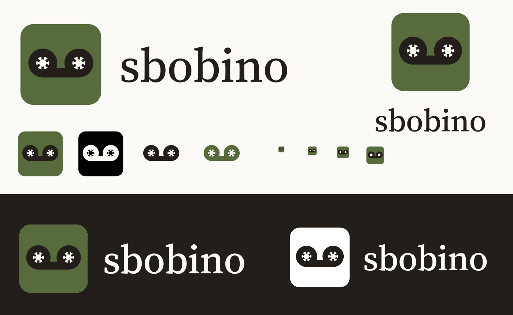

# Sbobino: regole d'uso del logo

## L'idea

Il simbolo mostra le due bobine di una musicassetta unite dal nastro, in nero su un quadrato salvia, con i mozzi dentati in color carta: Sbobino "sbobina" il nastro e lo fa diventare testo. I colori sono quelli dell'app.

## Versioni

| File (`svg/`) | Quando |
|---|---|
| `sbobino-simbolo` | Versione principale: icona dell'app, avatar, dove c'è spazio per un solo segno |
| `sbobino-simbolo-piccolo` | Sotto i 48 px: quadrato a tutta tela, nastro più grande, mozzi tondi senza denti |
| `sbobino-orizzontale` / `-negativo` | Simbolo + logotipo, su fondo chiaro / scuro |
| `sbobino-verticale` / `-negativo` | Simbolo sopra il logotipo, per spazi stretti e alti |
| `sbobino-logotipo` | Solo la scritta, quando il simbolo è già vicino (per esempio nella barra laterale dell'app) |
| `sbobino-simbolo-nero` / `-bianco` | A un colore: timbri, incisioni, stampa monocromatica. Il nastro è ritagliato e i mozzi sono pieni |
| `sbobino-nastro` (inchiostro, `-nero`, `-bianco`, `-salvia`) | Il solo nastro senza quadrato, a un colore: come segno grafico o filigrana |
| `sbobino-orizzontale-nero` / `-bianco` | Lockup a un colore |

`png/` ha le stesse versioni principali in raster.

## Colori

| Nome | HEX | RGB | CMYK (indicativo) | Token dell'app |
|---|---|---|---|---|
| Salvia | `#576b3c` | 87 107 60 | 19 0 44 58 | `play`, `oklch(0.5 0.075 128)` |
| Inchiostro | `#241e1a` | 36 30 26 | 0 17 28 86 | `ink`, `oklch(0.24 0.012 60)` |
| Carta | `#fcfaf6` | 252 250 246 | 0 1 2 1 | `paper`, `oklch(0.985 0.006 85)` |

- I CMYK sono una conversione diretta, non un profilo di stampa: per la stampa vanno provati, e il Pantone va scelto su mazzetta.
- Contrasto inchiostro su salvia: 2,8:1. Il simbolo regge grazie alla sagoma, ma a 16–32 px si usa sempre il taglio piccolo. Se serve più stacco, la salvia più chiara del token `ring-sage` (`#667a4d`) arriva a 3,5:1.
- Carta su inchiostro: 15,8:1; carta su salvia: 5,6:1.

## Logotipo

"sbobino" in minuscolo, Source Serif 4 (peso 500, dimensione ottica 24, spaziatura −0,01 em), convertito in tracciati: non serve il font per usarlo. Source Serif 4 è sotto SIL Open Font License, che ne permette l'uso in un logo. Il logotipo è sempre in inchiostro (su chiaro) o carta (su scuro), mai salvia.

**Da rifare:** dal 2026-10-04 la scritta "sbobino" nell'app (barra laterale, Informazioni) è in Commissioner (`FLAR` 100, `VOLM` 50), il font dei titoli. Il logotipo e i lockup in `svg/` e `png/` sono ancora in Source Serif 4 e vanno rifatti con Commissioner.

## Spazio libero e dimensioni minime

- Intorno al logo lascia libero almeno il raggio di una bobina (circa 1/5 del lato del quadrato) su ogni lato.
- Simbolo: 16 px con `sbobino-simbolo-piccolo`; da 64 px in su la versione con i denti.
- Lockup orizzontale: almeno 120 px (25 mm) di larghezza.

## Sfondi

- Su carta o bianco: versioni a colori.
- Su inchiostro o fondi scuri: `-negativo` (il quadrato resta salvia, il logotipo diventa carta).
- Su foto o fondi colorati: il simbolo a colori, che porta con sé il suo quadrato, o le versioni a un colore.

## Da non fare

- Cambiare i colori di quadrato, nastro o mozzi, o metterci gradienti e ombre.
- Usare il simbolo con i denti sotto i 48 px.
- Allungare, ruotare o ricomporre simbolo e logotipo con altre proporzioni.
- Riscrivere "sbobino" con un altro font o con la maiuscola nel logo (nel testo resta "Sbobino").
- Mettere il quadrato salvia su un fondo salvia o verde scuro, dove sparisce.

## Icone dell'app

`src-tauri/icons/` è generata con `bun tauri icon` da `png/sbobino-simbolo-1024.png`. `icon.ico` e `32x32.png` sono rifatti a mano con il taglio piccolo fino a 48 px. Il file `.bino` usa l'icona dell'exe (`bundle.fileAssociations`), quindi prende la stessa.

## Note

- Le bobine unite in basso sono anche il simbolo della segreteria telefonica: a rendere il segno riconoscibile sono i mozzi dentati e la salvia. Prima di registrarlo come marchio serve una ricerca di anteriorità.
- Le SVG sono generate da script Python (`kit.py`, geometria in `gen2.py`–`gen5.py`) rimasti in `.scratch/logo/` con le bozze dei concept.
